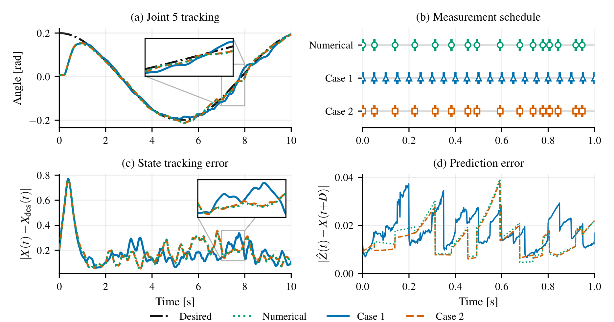

<div align="center">
  <a href="https://ccsd.ucsd.edu/home">
    
  </a>
  <a href="https://ucsd.edu/">
    
  </a>
</div>

# Sampling-Horizon Neural Operator Predictors for Nonlinear Control under Delayed Inputs



---

## Overview

This repository implements two neural operator predictor-feedback designs for nonlinear systems with input delay and sampled measurements. The predictors replace expensive numerical Picard iteration with learned Fourier Neural Operators (FNOs), enabling real-time delay compensation on a 6-DOF xArm manipulator modeled via [Pinocchio](https://github.com/stack-of-tasks/pinocchio).

Both designs approximate the predictor operator offline using an FNO and deploy it online for fast inference, achieving a **25× computational speedup** over the numerical baseline.


Two designs are implemented, corresponding to the two cases in the paper:

- **Case 1 — Uniform sampling, sampling-horizon prediction operator approximation:** the neural operator directly approximates the full sampling-horizon prediction operator $\hat{M}$, mapping the current measurement and input history to the predicted state trajectory over the next sampling interval. Requires uniform inter-sample times.

- **Case 2 — Bounded sampling, predictor approximation:** the neural operator approximates only the delay-compensating predictor $\hat{P}$, which is then composed with the closed-loop flow between measurements. Accommodates non-uniform but bounded sampling intervals at the cost of amplified approximation sensitivity.

---

## Installation

```bash
git clone https://github.com/lukebhan/NeuralOperatorPredictorsForSampledMeasurements.git
cd NeuralOperatorPredictorsForSampledMeasurements
python -m venv NeuralOperatorsPredictorsForSamplesMeasurementsEnv
source NeuralOperatorsPredictorsForSamplesMeasurementsEnv/bin/activate   # on Windows: NeuralOperatorsPredictorsForSamplesMeasurementsEnv\Scripts\activate
pip install -r requirements.txt
```

Dependencies: `pinocchio`, `neuralop`, `torch`, `numpy`, `scikit-learn`, `matplotlib`, `jupyter`. 

---

## Pretrained Resources

Pretrained datasets and models are hosted on Hugging Face:

- **Dataset:** *(link)*
- **Models:** *(link)*

Place the downloaded files in the `dataset/` and `models/` directories.

---

## Quick Start

After installation, download the pretrained models and datasets above, then run one closed-loop simulation:

```bash
python scripts/one_example.py
```

This runs a 20-second simulation (delay `D = 0.2 s`, uniform sampling `h = 0.05 s`) and plots joint tracking results.

To reproduce the figures from the paper, open `Evaluation.ipynb`. This notebook requires trained models and datasets to be present in `models/` and `dataset/` — either by downloading the pretrained resources above or by running the training pipeline from scratch. With those in place, executing the notebook end-to-end will regenerate all closed-loop simulation figures from the paper.

---

## Training from Scratch

If you want to retrain the models, first generate the datasets, then run training.

**Generate datasets:**

```bash
python scripts/case1_dataset.py   # Case 1 — sampling-horizon prediction operator dataset
python scripts/case2_dataset.py   # Case 2 — predictor approximation dataset
```

Training data is generated by rolling out noisy trajectories under the numerical predictor solved to machine precision. Rollouts run in parallel via `ProcessPoolExecutor`. Outputs are saved as compressed `.npz` files in `dataset/`.

**Train:**

```bash
python scripts/train_case1.py   # Case 1 — uniform sampling, sampling-horizon prediction operator
python scripts/train_case2.py   # Case 2 — bounded sampling, predictor approximation
```

Both use Adam + `ReduceLROnPlateau` and save the best checkpoint to `models/`. Both operators achieve an L2 validation error of ~10⁻⁴.

---

## Configuration

All experiment parameters live in `config/experiment.yaml`:

```yaml
dt: 0.001       # simulation timestep (s)
D: 0.2          # input delay (s)
Ts: 0.05        # sampling interval (s) — fixed for Case 1, upper bound for Case 2
T: 20.0         # simulation duration (s)
tau_max: 60.0   # torque saturation (Nm)
Kp_val: 40.0    # PD proportional gain
Kd_val: 14.0    # PD derivative gain
traj_w: 0.6     # reference frequency (rad/s)
traj_amp: 0.2   # reference amplitude (rad)
```

Scripts load this automatically via `load_config()` in `src/config.py`. To run with different parameters, edit the YAML — no code changes needed.

---

## Repository Structure

```
NeuralOperatorPredictorsForSampledMeasurements/
├── src/
│   ├── simulate.py               # Simulator, hybrid controller, numerical predictor
│   ├── config.py                 # Experiment configuration
│   ├── case1_dataset_builder.py  # Dataset generation — Case 1
│   ├── case2_dataset_builder.py  # Dataset generation — Case 2
│   ├── case1_fno.py              # FNO model — Case 1
│   ├── case2_fno.py              # FNO model — Case 2
│   ├── case1_trainer.py          # Training utilities — Case 1
│   ├── case2_trainer.py          # Training utilities — Case 2
│   ├── predictors.py             # Predictor factory wrappers
│   └── plot.py                   # Plotting helpers
├── scripts/
│   ├── case1_dataset.py          # Generate Case 1 dataset
│   ├── case2_dataset.py          # Generate Case 2 dataset
│   ├── train_case1.py            # Train Case 1 FNO
│   ├── train_case2.py            # Train Case 2 FNO
│   ├── one_example.py            # Run one simulation and plot
│   └── compare_data.py           # Dataset diagnostics
├── config/
│   └── experiment.yaml           # All experiment parameters
├── media/                        # Figures used in README
├── dataset/                      # ← place downloaded datasets here
├── models/                       # ← place downloaded models here
├── Evaluation.ipynb              # Reproduces paper results
└── xarm6.urdf
```

---

## Citation

```
```

---

## License

This work is licensed under a [Creative Commons Attribution-NonCommercial-ShareAlike 4.0 International License](http://creativecommons.org/licenses/by-nc-sa/4.0/).
